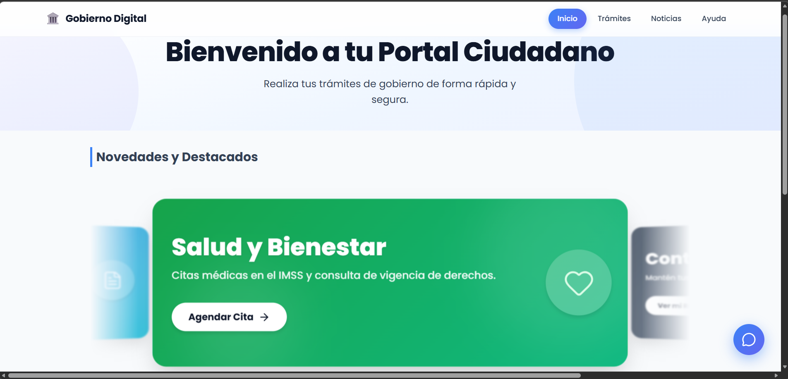
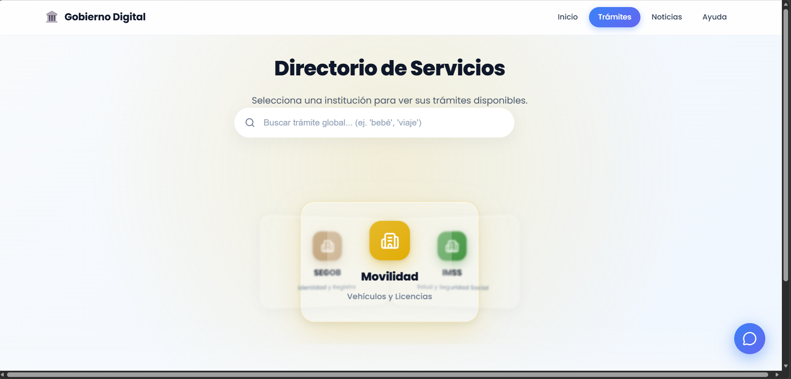
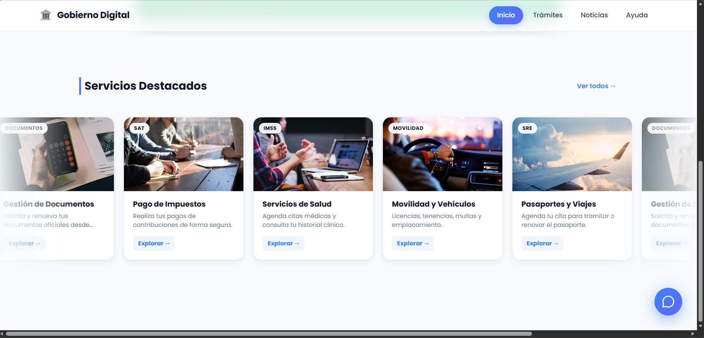
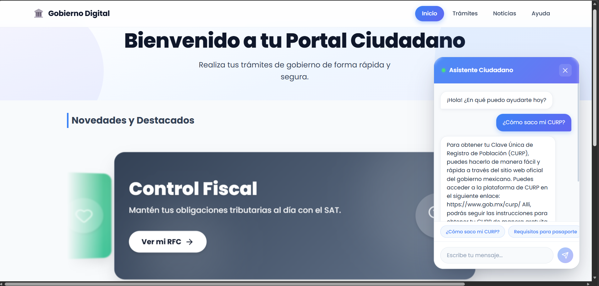

# 🏛️ Sistema de Gestión de Servicios Ciudadanos - Gobierno Digital

> **Centraliza trámites gubernamentales en una sola plataforma moderna, accesible y eficiente.**

[](https://ciudadno-gobierno-digital.vercel.app/)
[](https://github.com/barockatr/Ciudadno-Gobierno-Digital/issues)



## 📌 El Problema
Los ciudadanos enfrentan dificultades al navegar por múltiples sitios web gubernamentales dispersos y obsoletos para realizar trámites esenciales.
**Solución:** Esta plataforma centraliza servicios como CURP, Actas de Nacimiento y Citas SAT en una interfaz de usuario unificada, intuitiva y accesible (SPA), mejorando drásticamente la experiencia del ciudadano mediante micro-interacciones y UI Premium.

## ✨ Características Clave (Capacidades Actuales)

* **🤖 Asistente Ciudadano con IA:** Integración con **Groq SDK** (Llama 3/Mixtral) para respuestas instantáneas (<1s latencia) sobre dudas de trámites en lenguaje natural.
* **🌐 Directorio Dinámico (CoverFlow 3D):** Filtra y clasifica servicios gubernamentales usando una experiencia visual inmersiva usando matemáticas 3D y Framer Motion.
* **📰 Portal de Noticias en Tiempo Real:** Consumo de la API de **GNews** para alimentar comunicados oficiales con un layout editorial adaptable y modales de lectura estéticos.
* **�️ Onboarding Interactivo (Pre-Flight Modal):** Antes de redirigir al ciudadano a sitios externos institucionales complejos, se le presenta un "Checklist" interactivo de requisitos para evitar frustraciones.
* **💎 Diseño Glassmorphism Premium:** Uso extensivo de filtros de desenfoque (`backdrop-filter`), máscaras translúcidas y CSS Grid moderno para una experiencia limpia y nativa.



## 🛠️ Stack Tecnológico y Arquitectura

El proyecto es una **Single Page Application (SPA)** puramente Frontend, sin bases de datos ni backend propio, construida para ser ultraligera:

-  **Core Framework**
-  **Build Tool & Dev Server** (Módulos ES Nativos)
-  **Enrutamiento Declarativo**
-  **Estilado:** Vainilla CSS robusto con Variables CSS, Flexbox y Grid (Sin Tailwind, control atómico perfecto).
-  **Integración LLM para Chatbot**
-  **Fuente de Noticias en Tiempo Real**
-  **Animaciones y Transiciones de Layout**
-  **Iconografía Consistente**

## 🚀 Instalación Rápida

Sigue estos pasos para ejecutar el proyecto localmente:

1.  **Clonar el repositorio:**
    ```bash
    git clone https://github.com/barockatr/Ciudadno-Gobierno-Digital.git
    cd Ciudadno-Gobierno-Digital
    ```

2.  **Instalar dependencias:**
    ```bash
    npm install
    ```

3.  **Configurar variables de entorno:**
    Crea un archivo `.env` en la raíz del proyecto basándote en `.env.example` (Importante para que las APIs funcionen):
    ```env
    VITE_GROQ_API_KEY=tu_api_key_de_groq_aqui
    VITE_GNEWS_API_KEY=tu_api_key_de_gnews_aqui
    ```

4.  **Correr el servidor de desarrollo:**
    ```bash
    npm run dev
    ```
    
    Abre tu navegador en `http://localhost:5173` para ver la aplicación.

## 📸 Capturas de Pantalla

### Dashboard Principal y Directorio 3D
Una vista clara y dinámica de todos los servicios disponibles.


### Asistente Virtual (Chatbot via Groq)
Un asistente impulsado por IA para resolver dudas en tiempo real.


### Portal de Noticias
Consumo de comunicados oficiales en tiempo real desde fuentes gubernamentales.


## 💻 Implementación Técnica y Buenas Prácticas

### ⚡ Manejo de Asincronía y APIs Externas
Uso intensivo de `fetch` nativo para GNews y el SDK oficial para Groq, gestionando estados complejos de UI (`loading`, `error`, `success`) mediante `async/await` para no bloquear el hilo principal.

### 🛡️ Gestión de Errores (Try/Catch)
Implementación de UI de contingencia (fallbacks). Si la API de noticias falla, se muestra un componente de error interactivo con opción de "Reintentar", evitando pantallas blancas.

### 🔑 Seguridad de API Keys (Punto Crítico)
Actualmente el proyecto expone lógica de conexión a Groq y GNews del lado del cliente mediante `import.meta.env`. **Para despliegue a producción real, esto requiere una migración a un Backend for Frontend (BFF)**.

### 🧩 Manejo de Estado (Hooks)
El estado de la aplicación es puramente local usando los Hooks nativos de React (`useState`, `useEffect`), descartando Redux o Zustand para mantener el bundle final ultraligero y el rendimiento inmediato.

---

## 🏗️ Arquitectura y Estructura del Proyecto

El sistema está diseñado bajo un esquema modular y escalable usando Vite:

- `src/components/`: Componentes atómicos (Navbar, Modales de Noticias, Chatbot, CoverFlow3D) fuertemente acoplados a sus respectivos archivos `.css`.
- `src/pages/`: Vistas completas enrutadas (`Home`, `Tramites`, `Noticias`).
- `src/services/`: Capa de abstracción (`groqService.js`). Centraliza el prompt maestro de la IA.
- `src/data/`: Fuentes de verdad *Mockeadas* / Estáticas (`tramites.js`, `servicesData.js`) listas para ser reemplazadas por llamadas a una Base de Datos real.

---

## 🗺️ Roadmap (Próximas Mejoras y Escalabilidad)

Si bien la plataforma actual funge como una maqueta interactiva funcional de alta fidelidad, para escalar a un servicio masivo se contempla el siguiente roadmap:

#### 🔙 Arquitectura y Backend
- [ ] **Desarrollo de BFF (Backend for Frontend):** Migrar las llamadas de Groq y GNews a Node.js/Express para ocultar las API Keys y mejorar la seguridad.
- [ ] **Sistema de Caché (Redis):** Cachear las respuestas de noticias y algunos prompts de IA repetitivos para escalar a miles de usuarios sin saturar la cuota de las APIs.
- [ ] **Bases de Datos Real:** Migrar `tramites.js` a PostgreSQL/Supabase para editar servicios desde un panel administrativo.

#### � Producto y Funcionalidades Ciudadanas
- [ ] **Autenticación Ciudadana:** Integrar con sistemas de identidad digital (OAuth / Auth0) para crear el dashboard "Mis Trámites Realizados".
- [ ] **Buscador Semántico (RAG/Embeddings):** Mejorar la búsqueda para que entienda intenciones. Si el usuario escribe "quiero manejar", sugerir "Licencia de Conducir B1".
- [ ] **Agendado de Citas Nativas:** Expandir el `PreFlightModal` para conectarse a las agendas institucionales reales y apartar fechas desde la misma app.
- [ ] **Soporte Offline (PWA):** Configurar Service Workers con `vite-plugin-pwa` para que los ciudadanos puedan consultar requisitos sin conexión a internet.
- [ ] **Accesibilidad (a11y) y Multi-idioma:** Integrar Web Speech API (texto a voz) soporte `i18next` para dialectos indígenas nativos y extranjeros.

---

## 👨‍💻 Autor

**Antonio**

[](TU_LINKEDIN_REAL)
[](https://github.com/barockatr)

---
*Desarrollado para descentralizar y revolucionar la interacción ciudadano-gobierno en México.*
